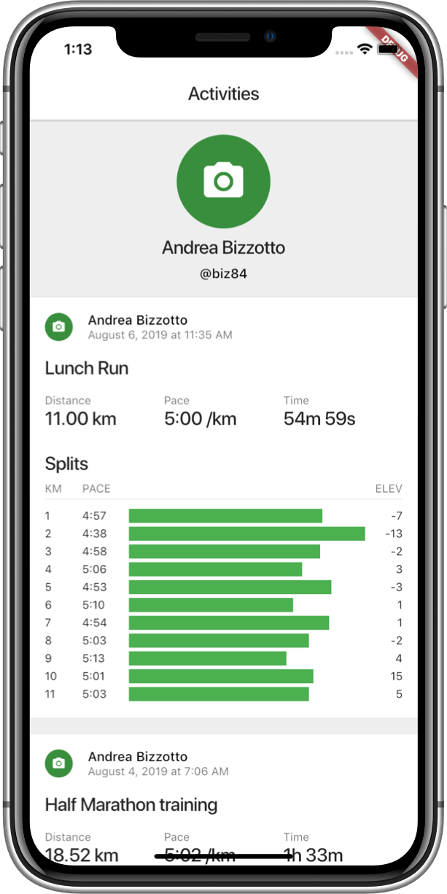

# Fitness Tracker - Flutter UI Demo

This project shows how to build a custom UI for a fitness tracker in Flutter.

---------

Related YouTube video tutorial here: 

## Preview

## Features

- Spreads, Collection-If, Collection-For
- Slivers
- Widget composition

## [License: MIT](LICENSE.md)